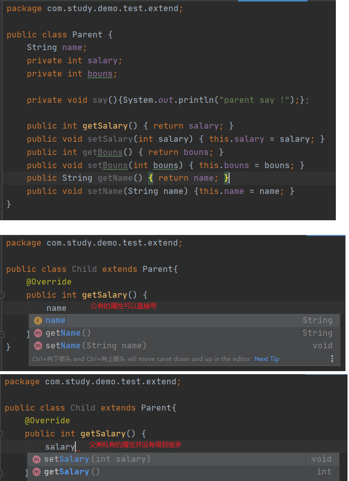

## 继承
### 父类私有属性/方法不会被继承
如图所示，父类中公有属性是可以被继承的，私有属性仍为父类私有。

### 抽象类的继承
抽象类不一定要有抽象方法、有抽象方法一定要声明为抽象类<br/>
抽象方法强制子类进行实现（假如子类是抽象类可以不进行实现）<br/>
```
//Parent.java
package com.study.demo.test.extend;
public abstract class Parent {
    public abstract void doIt();
}
//Child.java
package com.study.demo.test.extend;
public class Child extends Parent{
    @Override
    public void doIt() {
        System.out.println("child do");
    }
}
```
```java
package com.study.demo.test.extend;
public class TestExtend {
    public static void main(String[] args) {
        Parent p1 = new Child();
        Parent p2 = new Child2();
        p1.doIt();
        p2.doIt();
        /*
        由于Parent是抽象的，所以p1/p2不会调用Parent的doIt(),而是引用Child、Child2这样的具体对象的方法
        child do
        child2 do
         */
    }
}
```

## 超类 Object
#### equals方法
##### 1. ==
比较基本数据类型时比较的是值;<br/>
比较引用数据类型时，比较的是内存中存放的地址;<br/>
##### 2. equals
Object类中的equals实际也是 == , String是进行了重写<br/>
```

public boolean equals(Object obj) {
    return (this == obj);
}
```
重写equals需要满足以下规则：
1.自反性：对于任何非空引用 x, x.equals(x) 应该返回 true<br/>
2.对称性: 对于任何引用 x 和 y, 当且仅当 y.equals(x) 返回 true, x.equals(y) 也应该返回 true。<br/>
3.传递性： 对于任何引用 x、 y 和 z, 如果 x.equals(y) 返回 true， y.equals(z) 返回 true,x.equals(z) 也应该返回 true。<br/>
4.一致性： 如果 x 和 y 引用的对象没有发生变化，反复调用 x.equals(y) 应该返回同样的结果。<br/>
5.对于任意非空引用 x, x.equals(null) 应该返回 false<br/>
#### hashCode方法
Object 的 hashCode的算法可以通过JVM参数指定不同的策略，基本上不会重复。<br/>
String重新定义的hashCode，其与内容有关<br/>
重写了equals必须重写hashCode，因为在部分场合比如(Set集合)，在equals之前先进行hashCode的判断，
如果hashCode不同再进行equals以节约时间。而重写equals一般是以对象特征作为对比条件，比如a和b的name都是张三，但是是两个对象，
这时就出现了equals相等，但是hashCode不同的情况。
```
String ok1 = "OK";
String ok2 = new String("OK");
System.out.println(ok1.hashCode());//2524
System.out.println(ok2.hashCode());//2524
```